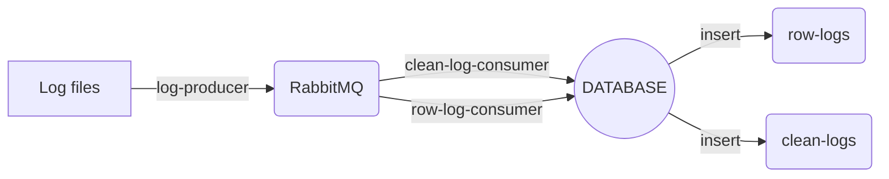

# Projet RabbitMQ

Ce projet  a  pour but de traiter des logs provenant d'un serveur  Nginx.

Les logs seront  traités  via une  routes  comprenant un  producer  et deux  consumers  qui  insérera  les logs traiter et nettoyer vers des tables  spécifiques  dans la base de données.



# Prérequis

* Python >= 3.10
* Docker
  * Suivre seulement l'étape Docker

# Installation

```console
git clone https://github.com/anthony-marais/Project_RabbitMQ
cd Project_RabbitMQ
python -m venv venv
```

Sur Windows exécutez :

```console
venv/Scripts/activate
```

ou sur Linux :

```console
source venv/bin/activate
```

Ensuite finir par :

```console
pip install -r requirements.txt
```

# Configuration

Ouvrir le fichier `.env.exemple` et remplacer les valeurs par défaut par celle de votre environnement. Renommer ensuite ce fichier en **'.env'**.

```console
cp .env.exemple .env
```

# Docker

Le fichier docker-compose créera 3 conteneurs :

- RabbitMQ
- MySQL
- phpMyAdmin
- 

## Construire et exécuter l'image docker :

```console
docker-compose up -d
```

# Log producer

Pour produire les events veillez run le fichier **'logs-producer.py'**

# Data-lake-consumer

Pour consomer les events de la route data-lake veillez run le fichier **'data-lake-consumer.py'**

# Data-clean-consumer

Pour consomer les events de la route data-clean veillez run le fichier **'data-clean-consumer.py'**
